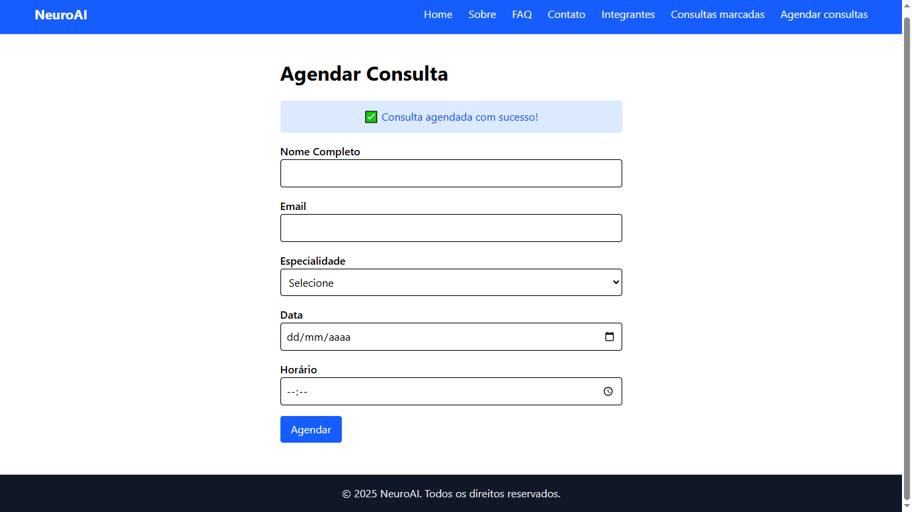
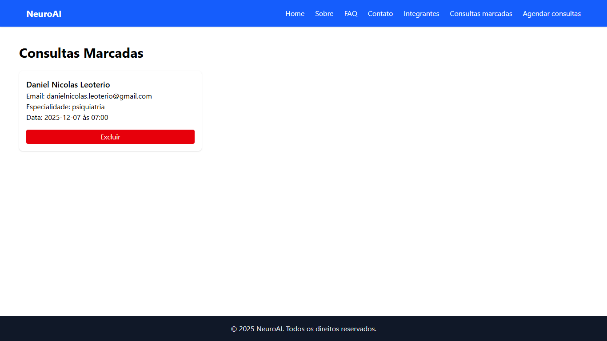

# NeuroAI 

Projeto desenvolvido durante a sprint3 de FrontEnd da FIAP.

[Acesse o site na Web](https://neuroai-sprint3.vercel.app/)

[Acesse o repositório no GitHub](https://github.com/NeuroAI-frontEnd/neuroai-sprint3)

[Veja a apresentação do site no Youtube](https://youtu.be/fhVwmxQMJvo?si=HLFJPDhHk8ciTdMO)


## Funcionalidades

- Agendamento de consultas
- Visualização e exclusão de consultas
- Página de FAQ interativa
- Formulário de contato com validação

## Estrutura

````
src/
 ├── assets/
 │    ├── carolina_ft.jpeg
 │    ├── Daniel_ft.jpg
 │    ├── Matheus_ft.jpg
 │    └── favicon.jpg
 ├── components/
 │    ├── Header.tsx
 │    └── Footer.tsx
 ├── pages/
 │    ├── Home.tsx
 │    ├── Sobre.tsx
 │    ├── Contato.tsx
 │    ├── Integrantes.tsx
 │    ├── AgendarConsulta.tsx
 │    ├── ConsultasMarcadas.tsx
 │    └── FAQ.tsx
 ├── App.tsx
 ├── main.tsx
 └── index.css
````
## Tecnologias

- React
- TailwindCSS
- typescript
- vite

## Capturas de Tela

### Página de Agendamento


### Página de Consultas Marcadas


## Integrantes

- **Daniel Nicolas Leoterio**  
  RM: 562186  
  Turma: 1TDSPV

  [GitHub](https://github.com/Dan1Nicolas)
  •
  [LinkedIn](https://www.linkedin.com/in/daniel-leoterio/)

- **Matheus Moya de Oliveira**  
  RM: 562822  
  Turma: 1TDSPV  
  [GitHub](https://github.com/matheusmoyaoliveira)
  •
  [LinkedIn](https://www.linkedin.com/in/matheusmoyaoliveira/)

- **Ana Carolina Pereira Fontes**  
  RM: 562145  
  Turma: 1TDSPV  
  [GitHub](https://github.com/CarolinaaFontes)
  •
  [LinkedIn](https://www.linkedin.com/in/ana-carolina-pereira-fontes/) 